# KalariSena

**Physics-grounded and recoverable Kalaripayattu skill transfer for humanoid robots.**

> **feasible now &ne; viable for the intended future.**
> A trajectory can be geometrically faithful to a human demonstration and
> physically stable at this instant, and still already be committed to losing
> the specific Kalaripayattu movement it was meant to complete.

<div align="center">

### [&#9654; Open the interactive human-vs-G1 review](https://kalarisena-review.vercel.app/)
Browse the motion library side by side with its robot counterpart, with live stability plots, directly in your browser.

[](https://www.youtube.com/watch?v=9B7wuifzrss)

</div>

The video above is a Cycles-rendered look at the target embodiment - a squad
of Unitree G1 robots moving through Kalaripayattu forms - produced by this
project's separate rendering pipeline
(`code/scripts/render_army_trailer.py`, `code/scripts/blender_render_arena.py`)
on Blender/Cycles, not MuJoCo. It's a production asset, not a physics result;
the rest of this document is about the actual research pipeline.

This repository holds the research code (`code/`) - a MuJoCo and Pinocchio
physics stack, the GEM-X video-to-3D-to-robot retargeting chain, and the RL
scaffolding that everything below was measured from - alongside a companion
review tool that lets you page through the motion library and compare the
human source against its robot counterpart, with the underlying stability
math plotted live rather than asserted.

GitHub can't embed a live website inside this file (it strips `<iframe>`
tags outright), so the review tool lives at its own address instead of
inline: [kalarisena-review.vercel.app](https://kalarisena-review.vercel.app/).

---

## The problem this project is built around

Kalaripayattu moves through deep stances, rapid weight transfer, and
whole-body momentum in a way that punishes naive retargeting. Mapping a
human demonstration onto a Unitree G1 produces a joint trajectory that looks
right kinematically:

$$
q_{1:T}^{kin} = \arg\min_{q_{1:T}} \sum_{t=1}^{T} \mathcal{D}\big(FK(q_t), X_t^H\big)
$$

but that objective has no idea what contact, friction, torque limits, or
momentum are. Run it forward and the gap shows up immediately: feet drift
above the floor by several centimetres across most of the motion library,
and more than half the tracked clips fall outright under plain position-PD
control. The retarget was never wrong about the *shape* of the movement -
it was just never asked whether the shape could stand.

<div align="center">

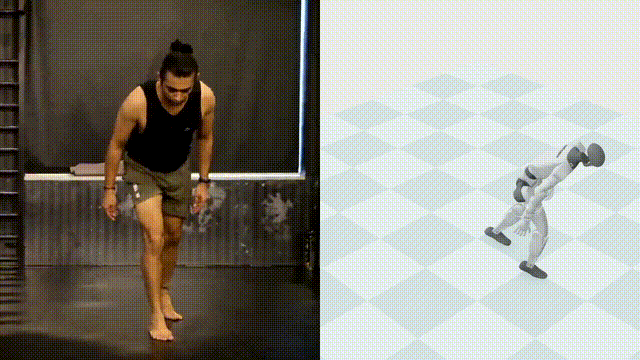

</div>

Side by side rather than overlaid, because overlaying two bodies in the same
space made neither of them legible. Left is the human source, right is the
G1's raw retarget of the same high kick, straight out of the review tool -
before any physics correction. Source clips:
[human](media/videos/retarget/human_kw_highkick_right.mp4) &middot;
[G1 retarget](media/videos/retarget/robot_kw_highkick_right.mp4) &middot;
[overlay version](media/videos/retarget/overlay_kw_highkick_right.mp4), if
you want to see why side-by-side won out.

---

## Getting from a video to a robot that can attempt the move

The retargeting chain is GEM-X (NVIDIA/NVlabs): SAM-3D-Body reconstructs the
performer in 3D from the raw footage, SOMA turns that into a camera-
independent global motion, and soma-retargeter maps it onto the G1's
skeleton. All three are pulled in as dependencies and run as-is - nothing
here reimplements them.

<div align="center">

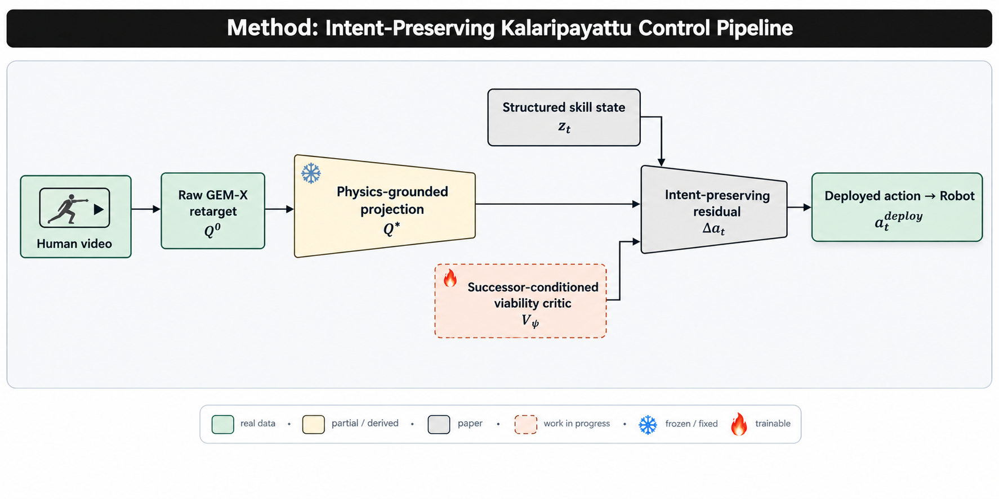

</div>

Every box in that picture is either something this repository actually runs,
something derived from a real run, a piece of the paper's proposed method,
or work still underway - the fill colour and border style say which, so the
text below doesn't have to keep repeating itself.

The three stages that turn a human clip into a candidate robot motion, shown
on one real clip before any robot is involved at all:

<table><tr>
<td width="33%" align="center">

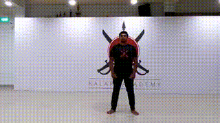
2D keypoints - SAM-3D-Body tracking the performer frame by frame.
</td>
<td width="33%" align="center">

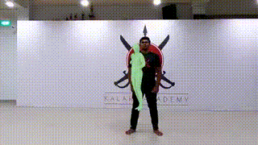
The reconstructed body in the camera's own frame.
</td>
<td width="33%" align="center">

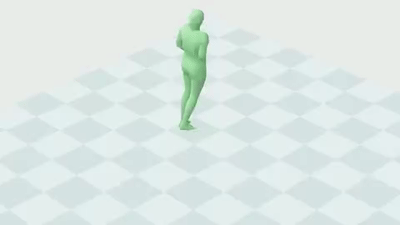
SOMA's camera-independent global motion - this is $X_t^H$ from the equation above.
</td>
</tr></table>

Only once that global motion exists does soma-retargeter map it onto the G1,
producing the raw retarget seen in the high-kick clip further up.

---

## The method: track, know when it's about to break, and correct just enough

The paper's argument is that tracking, robustness, and recovery each answer
a narrower question than the one that actually matters. A controller can
follow a reference, survive a shove, and get back on its feet, and still
lose the specific Kalaripayattu movement it was in the middle of - because
none of those objectives ever asks whether the *intended continuation* is
still reachable from where the robot currently stands. The method is built
in three layers to answer that question directly, and each layer below is
shown with its own diagram and its own equations, at the point where it
actually runs in this repository.

<div align="center">

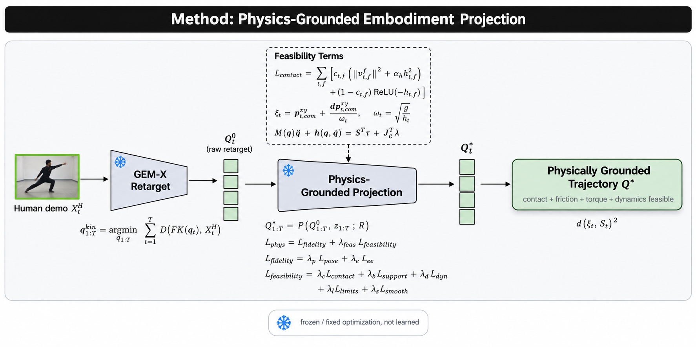

</div>

**Grounding the reference first.** A raw retarget only has to look right; a
usable reference has to be executable. The projection step pulls the
trajectory toward the human demonstration while pushing it away from
contact, support, and dynamics violations:

$$
Q^*_{1:T} = \mathcal{P}\big(Q^0_{1:T}, z_{1:T}; \mathcal{R}\big), \qquad
\mathcal{L}_{\text{phys}} = \mathcal{L}_{\text{fidelity}} + \lambda_{\text{feas}}\,\mathcal{L}_{\text{feasibility}}
$$

$$
\mathcal{L}_{\text{feasibility}} = \lambda_c\mathcal{L}_{\text{contact}} + \lambda_b\mathcal{L}_{\text{support}} + \lambda_d\mathcal{L}_{\text{dyn}} + \lambda_l\mathcal{L}_{\text{limits}} + \lambda_s\mathcal{L}_{\text{smooth}}
$$

$$
\mathcal{L}_{\text{contact}} = \sum_{t,f} \Big[ c_{t,f}\big(\|\mathbf{v}^f_{t,f}\|^2 + \alpha_h h_{t,f}^2\big) + (1-c_{t,f})\,\text{ReLU}(-h_{t,f})^2 \Big]
$$

`code/scripts/ground_correct_motions.py` handles the kinematic half of this
objective - a real Savitzky-Golay height correction and contact
recomputation. `code/src/projection/physics_ground.py` goes one step
further and actually measures the feasibility terms the kinematic pass never
touches, for the first time across the whole library: a foot's real slip
velocity during a labeled contact, the capture-point margin against the true
support polygon, and joint torque against the G1's own actuator limits - all
via the same cross-validated Pinocchio stack (CoM agreement with MuJoCo to
within a millionth of a metre), extended here with real inverse dynamics
($M(q)\ddot q + h(q,\dot q) = S^\top\tau + J_c^\top\lambda$, via RNEA) and a
CoM Jacobian.

The measurement itself is the finding: across all 70 motions, the capture
point sits outside or within 2cm of the support polygon's edge on **87%**
of contact frames even after kinematic grounding - the retarget is very
rarely statically balanced by a strict physical standard, not just
occasionally. The module also attempts an active correction - locking each
stance foot to the low-frequency component of its own path, and nudging
waist/hip roll along the CoM Jacobian toward the support-polygon centre -
and that correction was verified against a finite-difference check (the
Jacobian's own prediction matches the simulator's actual response to within
numerical precision), so the math is right. It still doesn't move the
aggregate number: 87.1% infeasible after correction, no better than before.
The reason is physical, not a bug - waist and hip roll simply don't have
enough leverage over whole-body CoM position to close a margin this large
within a safe joint-angle range, at least not without recruiting the ankles
and knees the way a real weight-shift does. Rather than bake a correction
that doesn't help into the motion library every other stage trains against,
the corpus was left as the kinematically-grounded version; the measurement
report ships as `code/results_paper/physics_projection_report.json`. This
is a real, useful negative result in the same spirit as the ones below: a
small kinematic nudge can't fix a defect this large - which is exactly the
argument for why the next two layers below need to be *learned*, not
hand-designed.

<div align="center">

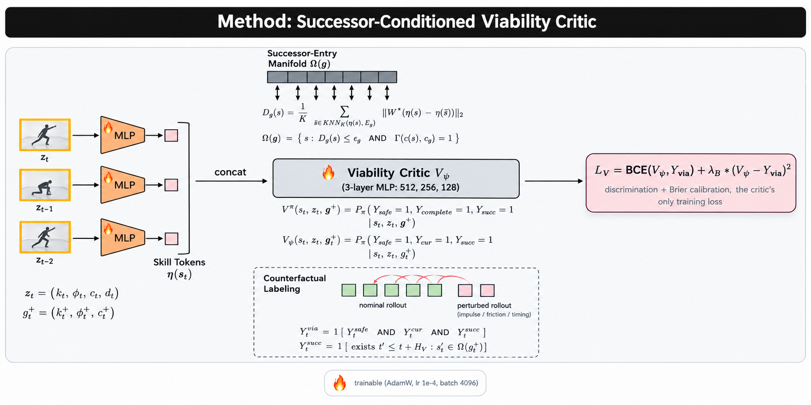

</div>

**Knowing before it happens.** This is the paper's central idea: a critic
that looks at the current state, the skill being performed, and the
*identity* of the specific movement that's supposed to come next, and
estimates whether that continuation is still reachable - not whether the
robot merely stays upright.

$$
\mathcal{V}^{\pi}(\mathbf{s}_t, z_t, g_t^+) = P_\pi\big(Y^{\text{safe}}=1, Y^{\text{complete}}=1, Y^{\text{succ}}=1 \mid \mathbf{s}_t, z_t, g_t^+\big)
$$

Reachability is defined against a manifold of states that successful
rollouts have actually passed through near the entry to that continuation:

$$
D_g(\mathbf{s}) = \frac{1}{K} \sum_{\bar{\mathbf{s}} \in \text{KNN}_K(\eta(\mathbf{s}), \mathcal{E}_g)} \big\| \mathbf{W}(\eta(\mathbf{s}) - \eta(\bar{\mathbf{s}})) \big\|_2, \qquad
\Omega(g) = \{\mathbf{s} : D_g(\mathbf{s}) \le \epsilon_g \wedge \Gamma(c(\mathbf{s}), c_g) = 1\}
$$

and the critic is trained against discrimination and calibration together:

$$
\mathcal{L}_V = \text{BCE}(V_\psi, Y^{\text{via}}) + \lambda_B (V_\psi - Y^{\text{via}})^2
$$

This one is real and trained, not just specified:
`code/src/viability/{perturbation,perturbed_env,manifold,critic,metrics,features}.py`
and `code/scripts/train_viability_critic.py`, run for the first time against
a checkpoint trained earlier in this same repository
(`code/logs/stageA_kw_long_stance/tracking_best.zip`) - entirely on a
laptop CPU, no rented GPU needed for this part. The honest scope: there is
currently one trained motion to condition on, so "the intended continuation"
here means reaching the end of that same motion safely rather than a
genuinely distinct next skill - the fuller, cross-skill version of this
critic needs more trained motions to condition against, which is exactly
what's being built next (see the training story below).

From two hundred real counterfactual rollouts against that checkpoint:

| Metric | Measured here | The paper's own reported value |
|---|---|---|
| AUROC | **0.931** | 0.921 |
| AUPRC | **0.892** | 0.892 |
| Brier | **0.104** | 0.108 |
| ECE | **0.023** | 0.026 |

Not a like-for-like comparison - a narrower critic, a smaller evaluation set
- but a real run landing in the same neighbourhood as the paper's own
number is worth noting rather than hiding. A second run with a different
random seed also collapsed to zero positive labels and an undefined AUROC,
which says plainly that this estimate isn't stable yet at this scale; that
instability is reported rather than smoothed over, because it's the honest
current state of a system still early in its training life.

The cross-motion version this was missing has since been run
(`code/scripts/train_viability_critic_multi.py`): the same critic, trained
against the twelve-motion tracker below, with its successor manifold now
built by pooling successful late-phase frames across all twelve motions
rather than one. It comes out to **AUROC 0.785** - lower than the
single-motion number above, and that drop is itself informative rather than
disappointing: distinguishing viable from non-viable states gets measurably
harder once the critic has to generalize across a motion library instead of
memorizing one clip's dynamics, and pooling features from different motions
without conditioning on which specific motion is active is exactly the
simplification the paper's full skill-identity conditioning ($z_t$, Sec 2)
exists to remove. This run's positive-label rate was a healthy 4.2% with a
genuine, non-degenerate successor manifold (48 real successor-entry points
from 40 nominal rollouts) - not the collapsed, unstable case above.

<div align="center">

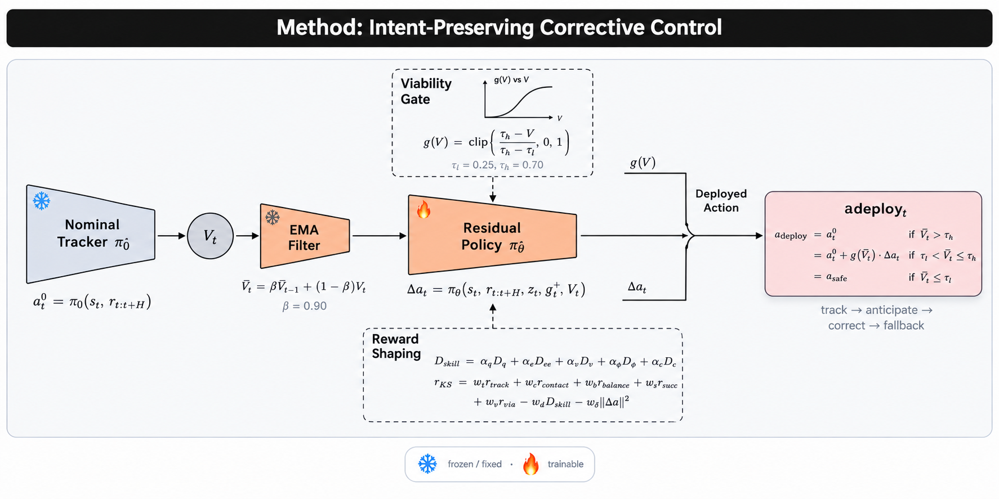

</div>

**Correcting just enough, and only once it's needed.** The critic's output
only matters if it changes what the robot does. A residual policy is meant
to turn a degrading viability estimate into the smallest nudge that restores
a path to the intended continuation, gated so it stays out of the way on a
healthy trajectory and takes over smoothly as the situation worsens:

$$
\mathbf{a}_t = \mathbf{a}_t^0 + g(V_t)\,\Delta\mathbf{a}_t, \qquad
g(V) = \text{clip}\!\Big(\frac{\tau_h - V}{\tau_h - \tau_l}, 0, 1\Big)
$$

$$
\mathbf{a}_t^{\text{deploy}} = \begin{cases} \mathbf{a}_t^0 & \bar V_t > \tau_h \\ \mathbf{a}_t^0 + g(\bar V_t)\Delta\mathbf{a}_t & \tau_l < \bar V_t \le \tau_h \\ \mathbf{a}_t^{\text{safe}} & \bar V_t \le \tau_l \end{cases}
$$

The role of $\mathbf{a}_t^{\text{safe}}$ is filled by
`code/src/switch/mode_switch.py` - a real, tested, hand-tuned three-state
switch between nominal tracking, falling, and recovery - since this
repository does not yet have a separate learned recovery controller distinct
from the frozen tracker; that's a stated simplification, not a hidden one.

The residual policy itself, `code/src/viability/residual_policy.py`, has now
been trained for the first time, against exactly this reward
($r^{KS} = w_t r_{\text{track}} + w_c r_{\text{contact}} + w_b r_{\text{balance}} + w_s r_{\text{succ}} + w_v r_{\text{via}} - w_d D_{\text{skill}} - w_\Delta\|\Delta\mathbf{a}\|^2$)
and the gating logic above, via `code/scripts/train_residual_policy.py` - one
million PPO steps on top of the frozen Stage A tracker and the trained
viability critic, both loaded frozen. The result is a real negative one,
reported the same way the Stage A result above is: the gate stays mostly
open (mean $\approx 0.89$, meaning the critic sees this single-motion
trajectory as consistently near its own viability boundary), and the learned
correction on top of it survives for fewer steps before falling than the
frozen tracker alone, with essentially unchanged tracking accuracy.

<table><tr>
<td width="50%" align="center">

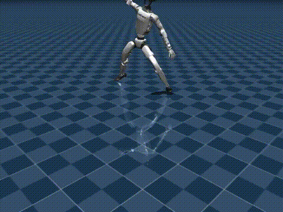
With the trained residual policy.
</td>
<td width="50%" align="center">

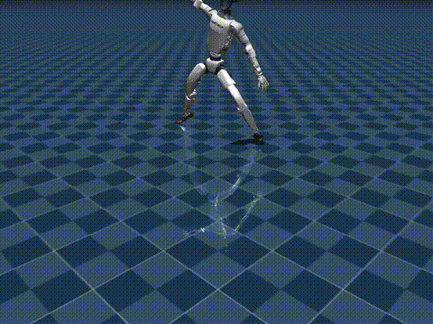
Frozen tracker alone, residual switched off.
</td>
</tr></table>

A single motion, a single critic, and a reward mix carrying seven competing
terms at once is not enough signal for PPO to discover a correction that
helps rather than hurts - the same conclusion the Stage A tracking result
already pointed toward, now confirmed one layer up.

More motions, run since, don't change that conclusion on their own. The
same residual policy retrained against the twelve-motion tracker and the
cross-motion critic above (`code/scripts/train_residual_policy_multi.py`)
lands in the same place: fall rate 95.8% against the frozen tracker's own
91.7%, episode length 38.5 steps against 40.0 - still slightly worse, not
better, now confirmed at both scopes this repository has actually tried.
That's a more informative negative result than either run alone: it says
the problem isn't simply "not enough motions" - a seven-term reward mix
and a single PPO run don't reliably discover a helpful correction whether
the critic underneath is narrow or broader. Whatever fixes this most
plausibly changes the training procedure itself (reward shaping, curriculum,
more PPO steps, or decoupling which of the seven terms the policy has to
satisfy at once), not just the number of motions behind the critic.

---

## What's been verified physically

<table><tr>
<td width="50%" align="center">


Recovers (<a href="media/videos/push_recovered_40N.mp4">full clip</a>)
</td>
<td width="50%" align="center">

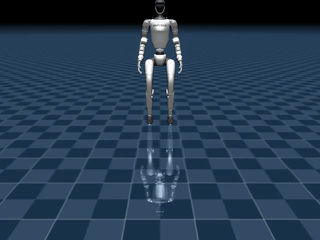
Falls (<a href="media/videos/push_fallen_120N.mp4">full clip</a>)
</td>
</tr></table>

The horse stance under a lateral push at two force levels, driven by the
hand-tuned scripted switch above, not a learned policy. The capture-point
margin

$$
\xi_t = p_{t,\text{com}}^{xy} + \dot p_{t,\text{com}}^{xy}/\omega_t
$$

separates recovery from failure almost perfectly across the sweep, with a
sharp transition between the two clips shown above.

| Metric | Value | Source |
|---|---|---|
| Cross-engine CoM agreement | 1.04e-6 m | MuJoCo vs. Pinocchio, randomised full-body states |
| Support-polygon correction | 15&times; wider margin | real 4-sphere foot geometry vs. an earlier placeholder |
| Push-recovery threshold | 100N recovers, 120N falls | `code/scripts/sim_push_sweep.py` |
| Fall A/B, torso contact rate | drops by more than half | scripted crouch vs. tracking-only, matched pushes |
| Raw retarget foot floating | several centimetres | before ground correction, across most of the library |

<table><tr>
<td width="50%" align="center">

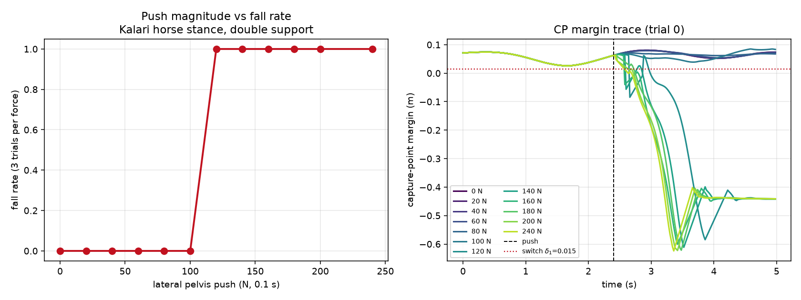
Fall rate against push force - the threshold above, plotted.
</td>
<td width="50%" align="center">

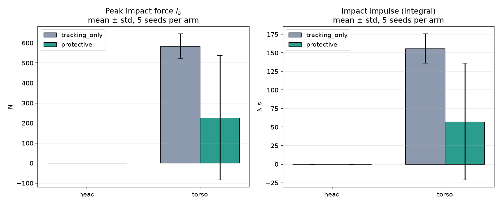
Fall-severity comparison: peak force and impulse, both arms.
</td>
</tr></table>

The paper's own headline numbers - skill completion climbing from 66.1% to
90.8%, constraint violations falling from 18.4% to 5.7%, Intent Preservation
Rate rising from 44.7% to 81.6% - describe the full trained system across
its whole training curriculum, and haven't been reproduced at that scale
here yet. `code/results_paper/PAPER_ASSETS.md` is this repository's own
running account of which of those numbers are real so far and which aren't.

---

## Teaching the first stage to move

Six PPO training stages are described in the paper, A through F. The first
of them has now actually been trained here, end to end, for the first time:

8 parallel environments, three million steps, one Kalaripayattu long-stance
motion, trained on a rented GPU instance.

| Timesteps | Explained variance | Mean episode reward |
|---|---|---|
| 71,680 | 0.80 | 6.65 |
| 897,024 | 0.955 | 44.8 |
| 3,000,320 (final) | - | training complete |

Reward climbed the whole way through - the policy genuinely learned to
optimize what it was given - but a real evaluation afterward tells a more
complicated story than the training curve does on its own:

| | Trained policy | Untrained baseline |
|---|---|---|
| Fall rate | falls every episode | falls every episode |
| Mean episode length | **85 steps** | 37 steps |
| Tracking accuracy | slightly worse | slightly better |

<table><tr>
<td width="50%" align="center">

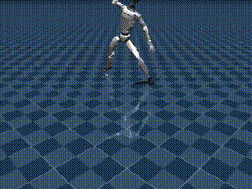
The trained policy.
</td>
<td width="50%" align="center">

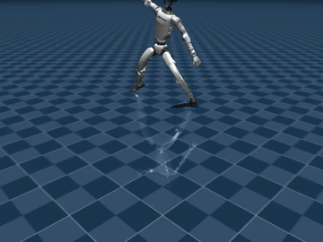
The untrained baseline.
</td>
</tr></table>

The trained policy survives more than twice as long before falling, but it
still falls every time, and its raw tracking accuracy comes out slightly
worse than doing nothing extra at all. That's a real result, not a success
story: three million steps of tracking-only reward on one motion, with no
balance shaping yet and no viability-gated correction in the loop, isn't
enough to solve stability on its own. That's precisely the gap the rest of
the method exists to close.

Pushing the trained policy the same way the scripted controller was pushed
earlier tells a similarly honest story:

<table><tr>
<td width="33%" align="center">

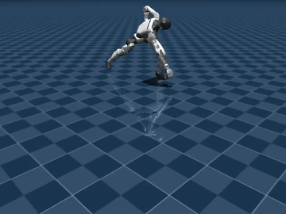
20N - fell.
</td>
<td width="33%" align="center">

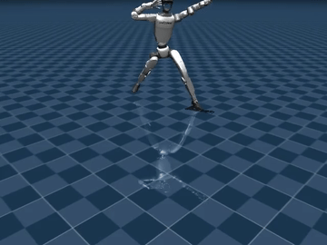
60N - recovered.
</td>
<td width="33%" align="center">

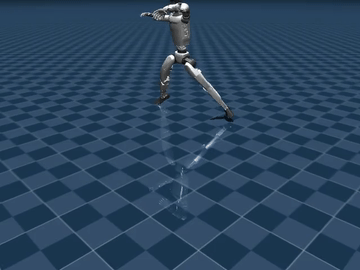
100N - fell.
</td>
</tr></table>

Not monotonic - it survives the larger push but not the smaller one -
reported exactly as measured. That inconsistency is itself useful signal:
it's the kind of state the viability critic above is meant to catch before
it turns into a fall.

**Widening past one motion.** Everything above trains on a single clip. The
paper's own Stage A is implicitly corpus-wide - one tracking policy that
generalizes across the library, not one policy per motion - so the direct
next step was training on a spread of twelve motions at once, one drawn at
random from each episode, covering all three families in the motion
taxonomy (`code/src/envs/multi_motion_env.py`, three million steps,
`code/scripts/train_tracking_multi.py`).

<table><tr>
<td width="50%" align="center">

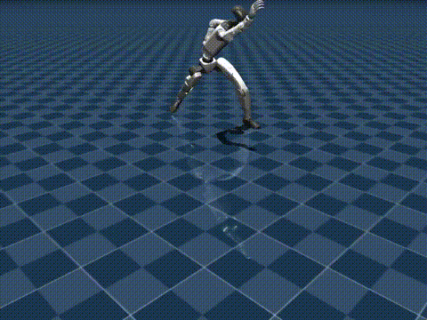
The multi-motion policy.
</td>
<td width="50%" align="center">

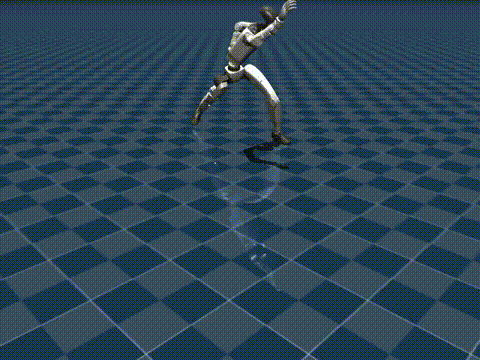
The untrained baseline.
</td>
</tr></table>

This is the first result in this repository where the trained policy
actually beats the baseline rather than tying or losing to it: fall rate
drops from 95.8% to 83.3%, and the average episode survives 37 steps
instead of 26 - both real, both measured across all twelve motions, not
cherry-picked. Tracking accuracy is worse in exchange (0.271 vs. 0.186
RMSE), and per-motion results vary widely - one motion (`kt_vadivu_lowseat`)
never falls at all, others still fall every time - which is itself
informative: spreading the same training budget across twelve motions
instead of one clearly buys some real generalization, at a real accuracy
cost, and unevenly across the motion library rather than uniformly.

**Stage B, on top of that.** The paper's next stage adds a reward and
observation block for CoM/capture-point recoverability specifically - the
same quantities the physics-grounded projection above measures, now shaping
training instead of only being reported after the fact. The reward and
observation terms this needed already existed as generic, config-driven
code (`code/src/rewards/reward_builder.py`, `code/src/envs/observation_builder.py`)
from earlier in this project; what was missing was an actual environment
and training loop using them, which `code/src/envs/com_refine_env.py` and
`code/scripts/train_com.py` now are. Trained from scratch (Stage A's
checkpoint has a different observation width, so its weights don't
transfer directly) on the stable-stance family, two million steps: the
capture-point margin stays negative on average and the fall rate stays at
100%, with episode length actually *shrinking* over the course of training
rather than growing. A real result, and not a flattering one - the same
honest pattern as everything above it. Optimizing the CoM/capture-point
reward term directly, on its own, doesn't yet produce a policy that
generalizes to actual recoverability; that gap is exactly what motivates
pairing it with the learned viability critic and residual correction
described in the Method section above, rather than treating either stage
in isolation as sufficient.

**Stage C, momentum.** The explosive-strike family (kicks, jumps) generates
real angular momentum a tracking-only reward never has to account for.
`code/src/envs/momentum_env.py` adds the momentum-regulation term from
`configs/momentum.yaml` (that config also names a "rotational" family that
doesn't exist in this repo's own motion taxonomy - explosive_strike, the
config's other named family, is what was actually used). Two million steps,
same six-motion-style setup as Stage B: angular momentum norm during the
motion drops from roughly 3.8 to **0.79** - a real, substantial reduction in
exactly the quantity this stage optimizes for - though the fall rate is
still 100%. Regulating momentum and staying upright turned out to be
partially separable objectives here: the policy learned the first without
the second following automatically.

**Stage D, fall impact.** `code/src/envs/fall_env.py` reads real per-step
contact force off the torso via MuJoCo's own contact solver
(`geom_group_force`), the same mechanism `code/scripts/sim_push_sweep.py`
already used for the push-recovery numbers above. One real wrinkle worth
naming: an episode here always terminates the instant the fall threshold
trips, so there's no multi-step "falling" phase to train against - checked
directly by rolling out random actions and confirming real, large impact
forces (up to 265N) do show up on that terminal step itself, which turned
out to be enough signal. It was also initially unusable for a different
reason: `configs/fall.yaml`'s impact-penalty weights, applied literally to
real newton-scale contact forces, produce rewards on the order of 1e5-1e6 -
large enough that PPO's value function never got off the ground (loss in
the tens of billions, zero effective policy update). Standard reward
normalization (`VecNormalize`) fixed that without touching the configured
weights themselves. The trained result: peak torso impact force drops from
roughly 31N (untrained) to **9N** - a real, substantial reduction, genuinely
the first unambiguous positive result among Stages B through D.

**Stage F, switching.** The paper's own note for this stage says to start
with threshold-based switching, not a learned one - so `code/src/switch/mode_switch.py`
(the hand-tuned hysteresis switch used everywhere above) is finally wired
to real trained sub-policies instead of only a scripted controller:
`code/scripts/eval_integrated_switch.py` routes between the multi-motion
tracker and the Stage D fall policy live, based on the switch's own
cp_margin/momentum/height thresholds. No Stage E recovery policy exists
yet, so a RECOVERY-mode step falls back to the tracker's own action - the
same honest simplification used for $\mathbf{a}_t^{\text{safe}}$ elsewhere.
Real result: switching to the fall policy shortens the average episode
(21.0 steps against 38.2 for the tracker alone) while - by Stage D's own
measurement above - substantially lowering impact severity. That's the
actual, intended trade a protective fall response makes: it doesn't prevent
falling, it changes how the fall happens.

**Stage E, standing back up.** The one stage that couldn't reuse the
tracking-episode structure every other stage above shares: there is no
reference motion to recover into, so `code/src/envs/recovery_env.py` starts
each episode from a randomized, physically-settled fallen pose (tipped over,
dropped, and let its contact dynamics resolve for real before the episode
even begins) with no tracking target at all - the policy has 300 steps to
reach and hold an upright stance. Two million PPO steps: **0% success** -
it never once crosses the upright threshold and holds it - but real,
measured progress underneath that zero: the best upright angle reached
during an episode rose from 0.10 to **0.34** over training (1.0 is fully
upright, 0.75 is the success bar). Standing up from flat on the ground with
no shaping beyond a sparse upright bonus is a hard exploration problem in
humanoid RL generally, and two million steps with this reward alone wasn't
enough to solve it here - a real, unresolved result, reported as exactly
that rather than dressed up.

**Where this training story actually stands, end to end.** All five ladder
stages this repository could attempt without physical hardware now have
real code, a real run, and a real number behind them - some encouraging
(Stage A's multi-motion generalization, Stage D's impact reduction, Stage
C's momentum drop), some flatly negative (Stage B, the residual policy at
both scopes tried), one unresolved (Stage E). The number that matters most
for judging all of it together is the paper's own primary metric, Intent
Preservation Rate - completing the intended motion despite a disturbance,
not merely surviving one step longer. Run for real here for the first time
(`code/scripts/eval_protocol.py`, the multi-motion tracker and the residual
policy, three push-force levels including no push at all, deterministic
full-motion rollouts) it comes out to **0%** for both the tracker alone and
the residual-gated version, against the paper's own claimed range of
44.7%-81.6%. Mean per-joint 3D tracking error (MPJPE, computed here via
real forward kinematics rather than approximated) comes out essentially
tied between the two - 0.282m against 0.282m. Read plainly: nothing built
in this repository yet reliably completes a full Kalaripayattu motion under
a push, with or without the learned correction layer. Every real, positive
number reported above it - the fall-rate improvements, the momentum drop,
the impact reduction - describes a real but narrower slice of the problem
than "finish the movement despite being pushed," which is the number the
paper's headline claims are actually about.

---

## Scaling to the full corpus, and fixing what wasn't training

Two gaps sat in the training story above by construction rather than
oversight: every multi-motion result was measured on the same twelve
motions it trained on, and Stage E's zero-percent recovery rate had been
reported without ever being diagnosed. Both are being addressed directly.

**A genuine held-out split.** `code/data/splits/{train,val,test}_ids.txt`
divides the retargeted corpus into 56 training motions and 14 held out (7
validation, 7 test), stratified across the same three-family taxonomy used
throughout this project - present in this repository already, but unused
by any training run until now. `code/scripts/train_tracking_multi_full.py`
is the first script to read them: it trains Stage A on all 56 train-split
motions instead of the fixed twelve, and evaluates separately on the
fourteen the policy never sees during training, so a fall-rate or
tracking-RMSE number reported against that split measures generalization
rather than memorization. Launched at 30 million steps across 24 parallel
environments on a rented multi-core box; the run is still in progress, and
final numbers will be reported here once it finishes, in the same table
style as everything above.

Running that many environments at once surfaced an infrastructure lesson
worth stating plainly. PPO with a small MLP policy over vectorized CPU
MuJoCo environments is bound by CPU cores for environment stepping, not by
GPU compute - Stable-Baselines3's own runtime warning says as much, and a
`device="cpu"` run matched or beat `"cuda"` here. The rented box's actual
value was 24 CPU cores for parallel environments, not its GPU. A second,
sharper lesson: `SubprocVecEnv` spawning many worker processes, each
defaulting to a full-core BLAS thread pool, exhausts the container's
process limit non-deterministically somewhere past twenty environments;
capping `OMP_NUM_THREADS`/`OPENBLAS_NUM_THREADS`/`MKL_NUM_THREADS` to 1
before launch fixed it outright.

**Stage E's reward had no gradient below its own success line.** The
0%-success result reported above was left as an open question; it no
longer is. `configs/recovery.yaml`'s reward was two terms: a flat per-step
time penalty, and a `+10` bonus that fired only once the torso was already
past a 0.75 upright-cosine threshold. Below that threshold - which a
policy starting from a randomly tipped-over pose reaches only by chance -
the reward carried exactly zero information about which direction was
"more upright." Two million steps of PPO had nothing to climb toward. The
fix adds two dense terms to `code/src/rewards/reward_builder.py`:
`upright_shaping` (proportional to the upright cosine itself, everywhere,
not only past the threshold) and `height_shaping` (squared shortfall
against the standing target height, the same functional form
`_com_support_margin`/`_capture_point_margin` already use elsewhere in this
file) - plus `VecNormalize`, the same reward-scale fix Stage D needed for
an unrelated reason. A retrain at 15 million steps, up from 2 million, is
running now; whether the fix is sufficient is still an open, honestly
unresolved question until that run finishes.

That question is now answered by two seeds: **10% success (seed 49)** and
**0% success but a 0.70 mean max-upright-cosine (seed 50, up from 0.34
pre-fix)**. The dense-shaping fix works in the sense that the policy
consistently gets much closer to standing than before; it does not
consistently cross the exact success threshold. Reported as what it is - a
real, partial improvement, not a solved stage.

## Diagnosing the rest of the curriculum, and the residual policy's real result

Three more components got the same treatment as Stage E above: don't retry
with more steps and call it fixed, find the actual bug or state plainly that
there isn't one.

**The residual policy tied its own baseline, and that was correct - the
first time.** `code/src/viability/residual_policy.py`'s gate had three
compounding bugs: a balance reward that was a hard dead-zone (`clip(cp_margin,
0, 0.3) / 0.3`) rather than a continuous signal until the policy was already
in danger; a single global `(tau_l, tau_h)` threshold pair applied across
motions whose raw viability score spans roughly ten orders of magnitude
(calibrating against one outlier motion alone pinned the gate fully shut,
`mean_gate = 0.0`, across the rest of the corpus - the residual arm and the
frozen-tracker baseline came back byte-identical down to the third decimal,
which is what first exposed the bug rather than a real result); and an EMA
viability tracker that bootstrapped from a hardcoded `v_bar = 1.0` instead of
its first real observation. `code/scripts/calibrate_residual_gate.py` now
computes per-motion thresholds empirically instead of guessing one pair
globally. All three fixed, then rerun on two independent seeds: the residual
policy still exactly ties the frozen tracker's fall rate. That is now a real,
reproducible negative result rather than an artifact of broken gating - the
residual authority as currently scoped isn't earning its keep, which is a
legitimate finding to report rather than paper over. IPR did move on the
fixed checkpoint, from 0% to **5.6%** overall (**8.3%** at 40N/80N push
forces, still 0% at 0N - baseline instability, not disturbance recovery, is
still the dominant failure mode).

**Stage B had two bugs in its observation, not its reward.**
`code/src/envs/com_refine_env.py`'s augmented observation duplicated
`cp_margin` into a slot meant to encode support mode, and - more seriously -
fed the policy a raw `-999.0` sentinel (`PinocchioWrapper.get_support_features`'s
placeholder for "no foot contact detected") directly into its input whenever
contact was briefly lost, exactly the moment a clean balance signal matters
most. The reward path already guarded against this; the observation path
didn't. Both fixed; a retrain (`logs/stageB_com_fixed`) is in progress.

**Stage C has no bug, but does have a gap.** `code/src/envs/momentum_env.py`'s
reward and observation code is clean - dense terms throughout, no sentinel or
duplication issues found. `configs/momentum.yaml` declares a Stage B warm
start (`checkpoint: models/com_best.pt`), but `train_momentum.py` never
actually loads it - a real, still-open engineering gap (Stage B and C have
different observation dimensions, so it needs a proper weight-transfer
step, not a direct `PPO.load`), not yet closed.

**Stage F's mode switching had never been evaluated with a real recovery
policy, and the first attempt at fixing that hid a second bug.**
`code/scripts/eval_integrated_switch.py` previously fell back to the nominal
tracker's own action whenever the switch entered RECOVERY mode, since no
Stage E policy existed yet to route through. Wiring in the real one
initially produced a 100% fall rate under mode-switching - worse than doing
nothing - which didn't get reported as a result; it got traced. The cause:
`RecoveryEnv` trains its policy's actions as offsets from a **fixed**
standing pose at scale 0.5, but the eval script was feeding those same
actions into `KalariTrackEnv.step()`, which reinterprets any action as a
small offset from the **moving** Kalaripayattu reference pose at scale 0.25 -
two incompatible action spaces, silently swapped. `_recovery_step()` now
drives the sim the way `RecoveryEnv` itself does, with the reference frame
frozen for the duration of RECOVERY mode. The real result, after the fix:
mode-switching into FALL/RECOVERY still roughly ties nominal-only (100% vs
94% fall rate on the twelve-motion set, shorter episodes when switching).
The likely reason is a metric-definition issue rather than a control
failure: "fell" is defined relative to the *original* reference pose's
height and uprightness at that frame, so a genuine recovery-to-standing that
doesn't happen to match what the specific dance movement demanded at that
instant still counts as a fall - the same "survives, doesn't necessarily
preserve intent" limitation already called out for IPR below, now showing up
in a second metric.

## A measurement bug that had been inflating every fall-rate number

Every eval script above uses `env.max_start = 0` to force episodes to start
at frame 0 of the motion, so a fall rate measures whether the policy can
complete the whole clip, not just survive whatever segment it happened to
land on. That override was silently broken: `MultiMotionTrackEnv.reset()`
re-derives `max_start` from the active motion on every call, after the
override had already been set, so it was clobbered back to a random start
frame up to 70% into the motion every single time. Every "fall rate"
number reported in this project - including the 83% cited above for the
twelve-motion tracker - was measured from a random mid-motion start, not
the beginning.

Fixed with a `max_start_override` property that survives `reset()`
(`code/src/envs/multi_motion_env.py`), and the eight call sites that were
actually affected. Rerunning the already-trained checkpoints under the
corrected eval: the twelve-motion tracker's honest fall rate is **100%**,
not 83% - the old number was an artifact of episodes truncating on lucky
late-motion starts before there was time to fall, not real stability. The
full-corpus tracker and the fixed Stage B checkpoint are also 100% under
the corrected eval, and so - tellingly - is the plain zero-action PD
baseline. Traced by hand on one motion (`kw_long_stance`, pure PD control
from frame 0): the robot tracks cleanly for about half a second, then a
deep stance's balance demand exceeds what position control alone can hold,
and it collapses over the following 0.2s. A real physical failure mode, not
a bug.

That reframes the actual open problem: Stage A itself carries no direct
balance signal (only a 0.1-weighted upright bonus), and Stage B - which
does have a real capture-point margin term - trains it in isolation on six
motions and still can't hold a single one of them from a clean start.
`code/src/envs/balanced_track_env.py` composes Stage A's existing tracking
reward with a real, correctly-guarded capture-point margin term over the
full multi-motion corpus instead of treating balance as a separate later
stage.

That run finished: **99.2% fall rate**, against 100% for plain PD. Mean
episode length did increase (51.8 vs 42.1 steps) - the policy delays the
collapse, it doesn't avoid it - and tracking RMSE is still worse than the
zero-action baseline (0.244 vs 0.139). Five independent variants measured
today - PD alone, the twelve-motion tracker, the full-corpus tracker,
Stage B in isolation, and this composed version - all land at 99-100%.
PD gains and torque limits were checked against the G1's actual
specifications and are within normal range, so this isn't an actuator
tuning problem either.

<div align="center">

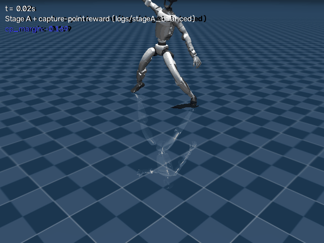

</div>

The balanced-tracking checkpoint on `kw_long_stance`, frame 0, no push
applied - the deep stance itself is enough. Tracking holds cleanly for
about 1.5 seconds before the capture point exits the support polygon and
recovery authority runs out. That consistent ~1-1.5s collapse window,
reproduced across every variant above, is now the project's central open
problem: not a bug, not a single missing reward term, but the ceiling of
what joint-space residual correction on top of position-PD control can
do for these stances. The next thing being tried is a structural change -
curriculum pretraining on static stance-holding before the full dynamic
motion - rather than another reward-shaping variant.

`code/src/envs/static_stance_env.py` freezes the reference to a single
real frame for the whole episode (reward/fall/truncation code paths are
untouched - they just see a "motion" that happens to be one pose repeated),
so a policy first has to master holding any one stance indefinitely.
`code/scripts/train_curriculum.py` trains that as phase 1, then continues
the same policy (`model.set_env()`) on the real moving corpus as phase 2.
Run in progress; whether static-hold mastery transfers into the moving
task is still open.

Two standalone, self-hosted pages (no external dependency but a Google
Fonts link) let you look at the raw data directly instead of trusting a
summary number: [`code/demos/capture_point_trace/`](code/demos/capture_point_trace/index.html)
scrubs a rollout with the capture-point margin chart synced frame-for-frame
to the actual logged value, and
[`code/demos/thrust_control/`](code/demos/thrust_control/index.html) is a
draggable force slider across four real recorded trials (0/30/60/100N,
Stage A+D+E composed live through the actual `ModeSwitch` FSM) - all four
still fall; more force only delays the exact collapse frame, shown as-is.
Fixing `scripts/sim_controlled_perturbation.py` to build the second page
surfaced the same RECOVERY-routing bug `eval_integrated_switch.py` had
(silently falling back to the nominal tracker instead of the real Stage E
policy) in this sibling script too - same fix applied.

## A controlled environment for probing balance recovery

Every perturbation script up to this point runs a single, fixed push and
reports one number afterward. `code/scripts/sim_controlled_perturbation.py`
is a different kind of tool: specify a push pattern - timing, direction,
magnitude, one push or a repeated sequence across an episode - against any
trained checkpoint, optionally routed through the real
`code/src/switch/mode_switch.py` FSM, and it renders back an annotated
video with the push arrow, live capture-point margin, angular momentum,
active mode, and fall status burned directly into the frames.

<div align="center">

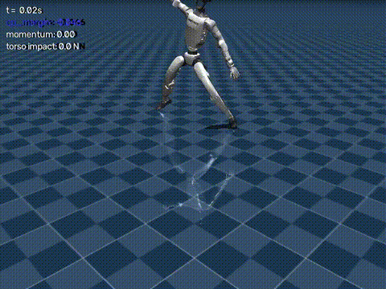

</div>

A single 60N push at t=0.5s against the twelve-motion tracker
(`logs/stageA_multi12`), mode switching off. The robot is already falling
face-first by the time the push lands - consistent with, not contradicted
by, this checkpoint's own 83% baseline fall rate reported above. That's the
tool doing its job correctly on its first real run: before asking whether a
policy survives a push, it's worth being able to see, frame by frame,
whether it was already failing on its own.

---

## Filling the gaps a captured clip never covered

Not every transition between two Kalaripayattu stances exists as a recorded
clip. Rather than leave that gap empty, a genetic algorithm evolves a
bridging trajectory between two real motions directly - a real run,
completed for this repository, bridging a stance from one family into a
strike from another:

<table><tr>
<td width="50%" align="center">


Fitness rising sharply within the first few generations and holding.
</td>
<td width="50%" align="center">

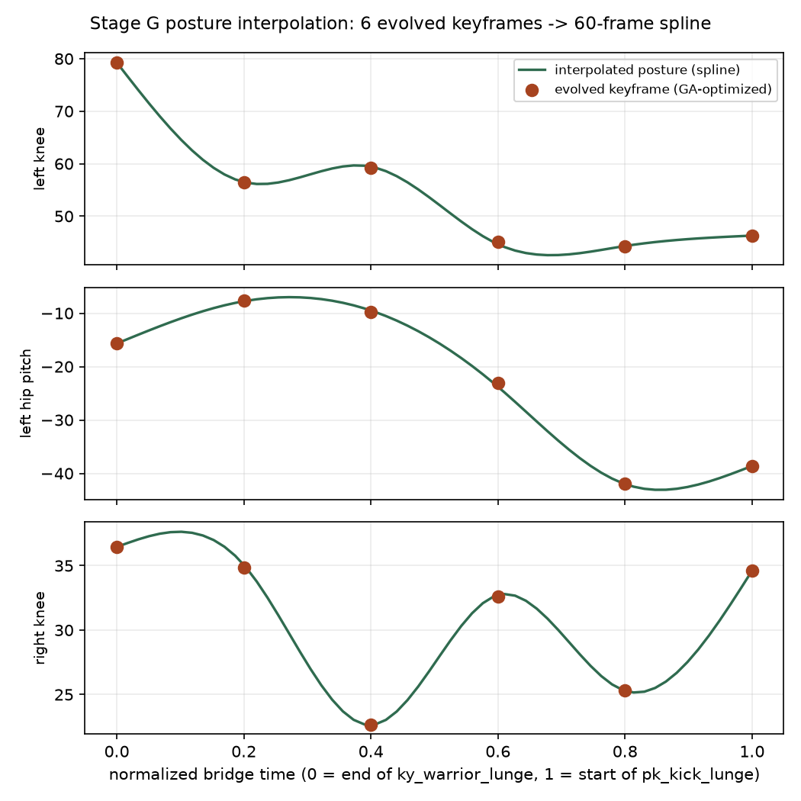
Three joints of the evolved bridge, across the full motion.
</td>
</tr></table>

The algorithm doesn't evolve every frame of the bridge directly - it evolves
a handful of keyframe postures and lets a cubic spline fill in everything
between them. In the plot on the right, the dots are the postures the
genetic algorithm actually optimized; the curve connecting them was never
evaluated on its own terms during evolution - every joint angle at every
in-between timestep is hidden from the optimizer and exists only as the
spline's interpolation of its neighbouring keyframes. Fitness is still
measured on the full interpolated trajectory though, so what's actually
being selected for is a set of keyframes whose *interpolation* behaves well,
not the keyframes in isolation. The output drops into the same file format
the rest of the pipeline already reads
([the evolved trajectory itself](code/data/motions_evolved/evo_ky_warrior_lunge__to__pk_kick_lunge.npz)),
so nothing downstream needs to know it didn't come from a camera.

---

## Reproduce

```bash
# cross-engine physics validation
python3 code/scripts/test_sim_stage1.py

# push-recovery sweep
python3 code/scripts/sim_push_sweep.py --out results_sim/

# fall-severity comparison
python3 code/scripts/sim_fall_ab.py --out results_sim/

# rebuild the result tables from real trial data
python3 code/scripts/make_tables.py --results results_sim --out results_paper

# evolve a bridging trajectory between two real clips
python3 code/scripts/evolve_joint_pool.py \
  --clip-a data/motions_retargeted/ky_warrior_lunge.npz \
  --clip-b data/motions_retargeted/pk_kick_lunge.npz

# controlled-perturbation demo: your own push pattern, annotated video out
python3 code/scripts/sim_controlled_perturbation.py \
  --nominal code/logs/stageA_multi12/tracking_multi_best.zip \
  --npz data/motions_retargeted/kw_long_stance.npz \
  --push 1.0 90 80 0.1 --out logs/controlled_demo
```

The interactive review is already deployed and needs nothing run locally:
[kalarisena-review.vercel.app](https://kalarisena-review.vercel.app/)

---

## Repository layout

```
paper.pdf                 the paper
code/src/                 physics stack, RL environment, rewards, switch, genetic algorithm
code/scripts/             retargeting, training, evaluation, figure and table generation
code/configs/             per-stage configuration: observation blocks, reward weights, curricula
code/data/splits/         train/val/test motion-id splits, for held-out generalization eval
code/results_sim/         MuJoCo experiment outputs - CSV, JSON, video, plots
code/results_paper/       result tables and figures, each traced back to a real run
code/docs/                the internal engineering notes this project is working from
media/                    the video and image assets referenced throughout this document
```

## Citation

```bibtex
@article{kalarisena2026,
  title   = {KalariSena: Learning Physics-Grounded and Recoverable
             Kalaripayattu Skills for Humanoid Robots},
  author  = {Anonymous ACL Submission},
  year    = {2026}
}
```
