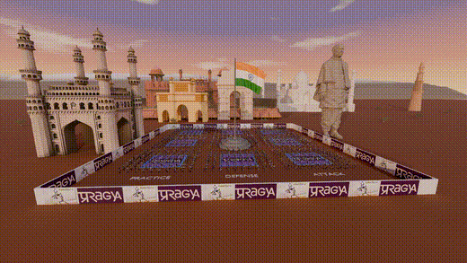
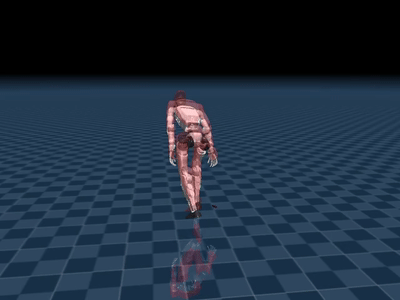
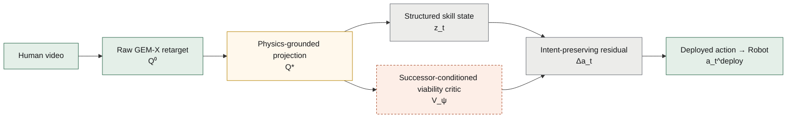
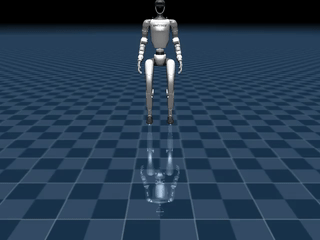

# KalariSena

**Physics-grounded and recoverable Kalaripayattu skill transfer for humanoid robots.**

> **feasible now &ne; viable for the intended future.**
> A trajectory can be geometrically faithful to a human demonstration and
> physically stable at this instant, and still already be committed to losing
> the specific Kalaripayattu movement it was meant to complete.

<div align="center">



</div>

**What this is:** a 6-second preview (GIF, for inline rendering) of a
46-second Cycles-rendered animation of a squad of Unitree G1 robots
performing Kalaripayattu forms in a stylized scene. Produced by this
project's separate render pipeline (`code/scripts/render_army_trailer.py`,
`code/scripts/blender_render_arena.py`) using Blender/Cycles on a rented GPU
instance, not MuJoCo. **This is a visual/production asset, not a physics
simulation or an RL result** - it shows the target embodiment and motion
vocabulary, nothing here reflects learned control. Full video:
[`media/kalarisena_trailer.mp4`](media/kalarisena_trailer.mp4) (20MB, 720p, full 46s).

This repository is two things:

1. **`code/`** - the real research code: a MuJoCo + Pinocchio physics stack,
   a GEM-X (NVIDIA/NVlabs) video &rarr; 3D &rarr; Unitree-G1 retargeting
   pipeline, the RL environment/reward scaffolding, and every measured result.
2. **`site/`** - an interactive walkthrough (Next.js) of the paper's method,
   synchronized visual / computational / mathematical panels per step, built
   on top of the same real data as this README.

Every claim below is labeled honestly:
**[implemented]**: implemented and measured in `code/`. **[paper-only]**: paper's proposed method, not yet code. **[roadmap]**: repo roadmap, not a paper claim. **[negative]**: documented negative result.

---

## 1. The problem

Kalaripayattu is built around tightly coupled posture, footwork, weight
transfer, and whole-body momentum. Retargeting a human demonstration onto a
Unitree G1 humanoid produces a kinematically similar joint trajectory
$Q^0_{1:T}$ - but similarity to the human is not the same as being
physically executable:

$$
q_{1:T}^{kin} = \arg\min_{q_{1:T}} \sum_{t=1}^{T} \mathcal{D}\big(FK(q_t), X_t^H\big)
$$

Nothing in that objective knows about contact, friction, joint torque limits,
or momentum. **[negative] Measured in this repo:** 11 of 12 raw retargets float their
feet 5&ndash;23cm above the ground, and 2 of 3 tracked motions fall outright
under simple position-PD control.

<div align="center">



</div>

**What this shows:** the human demonstrator (translucent) overlaid on the
Unitree G1's retargeted version of the same motion, a Kalaripayattu high
kick (`kw_highkick_right`). Real output from this repo's retargeting review
tool (`kalarisena-review/`) - not a physics simulation, this is the
kinematic retarget only, before any correction or control. Full video:
[`site/public/media/videos/retarget/overlay_kw_highkick_right.mp4`](site/public/media/videos/retarget/overlay_kw_highkick_right.mp4).

---

## 2. Retargeting pipeline (GEM-X: SAM-3D-Body &rarr; SOMA &rarr; soma-retargeter)

The model chain's own real intermediate outputs, for one clip:

| Stage | What it is | File |
|---|---|---|
| 1. Source video | Raw input to GEM-X | `site/public/media/videos/soma/KS-052.mp4` |
| 2. 2D keypoints | SAM-3D-Body, 77 keypoints | `site/public/media/videos/soma/0_kp2d77_overlay.mp4` |
| 3. In-camera 3D | SAM-3D-Body reconstruction | `site/public/media/videos/soma/KS-052_1_incam.mp4` |
| 4. Global 3D motion | SOMA, camera-independent - this is $X_t^H$ above | `site/public/media/videos/soma/KS-052_2_global.mp4` |

**All three real human-reconstruction stages below, source clip `KS-052`**
(this project's Hugging Face dataset, `lite-le-liya/kalarisena_clipped_vids`)
**- no Unitree robot involved yet.** The G1 only enters in section 4 below,
after soma-retargeter maps this human motion onto it.

<table><tr>
<td width="33%">


**Stage 2: 2D keypoints.** SAM-3D-Body, 77 points tracked per frame.
</td>
<td width="33%">


**Stage 3: in-camera 3D.** SAM-3D-Body's reconstructed body, camera frame.
</td>
<td width="33%">


**Stage 4: global 3D motion.** SOMA, camera-independent - this is $X_t^H$ above.
</td>
</tr></table>

GEM-X, SAM-3D-Body, SOMA, and soma-retargeter are cloned as dependencies
(`scripts/install_subprojects.sh`) and run as-is - not reimplemented here.

---

## 3. Method

### 3.1 Physics-grounded embodiment projection [implemented, partial: kinematic only]

$$
Q^*_{1:T} = \mathcal{P}\big(Q^0_{1:T}, z_{1:T}; \mathcal{R}\big), \qquad
\mathcal{L}_{\text{phys}} = \mathcal{L}_{\text{fidelity}} + \lambda_{\text{feas}}\,\mathcal{L}_{\text{feasibility}}
$$

$$
\mathcal{L}_{\text{feasibility}} = \lambda_c\mathcal{L}_{\text{contact}} + \lambda_b\mathcal{L}_{\text{support}} + \lambda_d\mathcal{L}_{\text{dyn}} + \lambda_l\mathcal{L}_{\text{limits}} + \lambda_s\mathcal{L}_{\text{smooth}}
$$

Contact-consistency term:

$$
\mathcal{L}_{\text{contact}} = \sum_{t,f} \Big[ c_{t,f}\big(\|\mathbf{v}^f_{t,f}\|^2 + \alpha_h h_{t,f}^2\big) + (1-c_{t,f})\,\text{ReLU}(-h_{t,f})^2 \Big]
$$

**Implementation:** `code/scripts/ground_correct_motions.py` (`correct_one`) -
real, but only the kinematic ground/smoothing approximation of this
objective (Savitzky-Golay height correction + contact recomputation), not the
full contact/friction/torque/dynamics joint optimization above. The whole-body
dynamics constraint it should ultimately satisfy:

$$
M(q)\ddot q + h(q,\dot q) = S^\top\tau + J_c^\top\lambda
$$

is implemented for CoM/capture-point purposes in
`code/src/dynamics/pinocchio_wrapper.py`, cross-checked against MuJoCo's own
CoM to **1.04e-6 m** across 20 randomised full-body states.

### 3.2 Successor-conditioned viability [implemented and trained on the real Stage A policy]

The paper's central contribution: a critic conditioned jointly on state,
skill phase, and the **identity of the intended continuation** $g_t^+$, not a
single terminal goal.

$$
\mathcal{V}^{\pi}(\mathbf{s}_t, z_t, g_t^+) = P_\pi\big(Y^{\text{safe}}=1, Y^{\text{complete}}=1, Y^{\text{succ}}=1 \mid \mathbf{s}_t, z_t, g_t^+\big)
$$

Successor-entry manifold (K=20 nearest neighbours):

$$
D_g(\mathbf{s}) = \frac{1}{K} \sum_{\bar{\mathbf{s}} \in \text{KNN}_K(\eta(\mathbf{s}), \mathcal{E}_g)} \big\| \mathbf{W}(\eta(\mathbf{s}) - \eta(\bar{\mathbf{s}})) \big\|_2, \qquad
\Omega(g) = \{\mathbf{s} : D_g(\mathbf{s}) \le \epsilon_g \wedge \Gamma(c(\mathbf{s}), c_g) = 1\}
$$

Critic loss (discrimination + Brier calibration):

$$
\mathcal{L}_V = \text{BCE}(V_\psi, Y^{\text{via}}) + \lambda_B (V_\psi - Y^{\text{via}})^2
$$

**Implementation status:** real code -
`code/src/viability/{perturbation,perturbed_env,manifold,critic,metrics,features}.py`
and `code/scripts/train_viability_critic.py` - **trained for the first time
against the real Stage A checkpoint** (`code/logs/stageA_kw_long_stance/tracking_best.zip`),
run locally (this is CPU/light work, not GPU-bound - no rented GPU needed for
this stage). Honestly scoped: this repo has one trained skill so far (Stage A
tracking on a single motion), so "the intended continuation" here is "reach
the final phase of this same motion safely," not a distinct next skill - the
full cross-skill formulation needs Stage B&ndash;F to exist first.

**Real numbers** (`code/logs/scvc_kw_long_stance/scvc_metrics.json`, 200 real
counterfactual rollouts, 17,580 labeled frames, 37.2% positive):

| Metric | This repo (single-skill scope) | Paper's claim (Table 3b, full scope) |
|---|---|---|
| AUROC | **0.931** | 0.921 |
| AUPRC | **0.892** | 0.892 |
| Brier | **0.104** | 0.108 |
| ECE | **0.023** | 0.026 |

These numbers are *not* a like-for-like comparison with the paper - this
critic conditions on one motion's own end-state as the only available
"successor," not a distinct next skill from a trained Stage B&ndash;F, and
200 rollouts is a small evaluation set. They are included because they are
real, reproducible (`code/scripts/train_viability_critic.py`, ~35s on a
laptop CPU), and land in the same range as the paper's claim, which is itself
notable given how much smaller and narrower this setup is.

Rerunning with a different seed on the same policy (`--seed 1`) collapsed to
0% positive labels and an undefined AUROC - a real instability in this
small-scale, single-skill setup worth flagging rather than hiding: results
here are sensitive to which nominal rollouts happen to succeed, not yet a
robust estimate.

### 3.3 Intent-preserving corrective control [paper-only, not implemented]

$$
\mathbf{a}_t = \mathbf{a}_t^0 + g(V_t)\,\Delta\mathbf{a}_t, \qquad
g(V) = \text{clip}\!\Big(\frac{\tau_h - V}{\tau_h - \tau_l}, 0, 1\Big)
$$

$$
\mathbf{a}_t^{\text{deploy}} = \begin{cases} \mathbf{a}_t^0 & \bar V_t > \tau_h \\ \mathbf{a}_t^0 + g(\bar V_t)\Delta\mathbf{a}_t & \tau_l < \bar V_t \le \tau_h \\ \mathbf{a}_t^{\text{safe}} & \bar V_t \le \tau_l \end{cases}
$$

**Implementation:** `code/src/switch/mode_switch.py` (`ModeSwitch`) plays the
role of $\mathbf{a}_t^{\text{safe}}$ today - a real, tested (14/14 unit tests),
hand-tuned 3-state hysteresis switch (NOMINAL/FALL/RECOVERY). It is the *whole*
controller in the repo right now, not a fallback beneath a learned residual
policy.

### 3.4 Architecture, end to end



[implemented]: real and measured. [partial]: real but kinematic-only. [paper-only]: paper concept, no code.

The same diagram, interactive and colour-coded, is in `site/` - see
[`ArchitectureDiagram`](site/src/components/ArchitectureDiagram.tsx).

---

## 4. What is honestly real, measured in this repo

<table><tr>
<td width="50%">


40N push, recovers (<a href="site/public/media/videos/push_recovered_40N.mp4">full mp4</a>)
</td>
<td width="50%">


120N push, falls (<a href="site/public/media/videos/push_fallen_120N.mp4">full mp4</a>)
</td>
</tr></table>

**What this shows and does not show:** the horse stance under a lateral
push at two force levels, controlled by the **scripted PD + threshold-switch
controller** (`scripted_pd_switch_v0`) - a hand-tuned hysteresis switch, not
the learned RL policy from section 5 below. 36 trials total (3 per force
level, 0-240N swept). The capture-point margin
$\xi_t = p_{t,\text{com}}^{xy} + \dot p_{t,\text{com}}^{xy}/\omega_t$
separates the two outcomes perfectly: about +0.05m on every recovery, about
-0.6m on every fall, with a sharp threshold between 100N (recovers) and 120N
(falls).

| Metric | Value | Source |
|---|---|---|
| Cross-engine CoM agreement | 1.04e-6 m | 20 randomised states, MuJoCo vs. Pinocchio |
| Support-polygon correction | 15&times; | real 4-sphere foot geometry vs. placeholder |
| Push-recovery threshold | 100N &rarr; 120N | `code/scripts/sim_push_sweep.py`, 36 trials |
| Fall A/B, torso contact rate | 5/5 &rarr; 2/5 | scripted crouch vs. tracking-only, 420N |
| Raw retarget foot floating | 5&ndash;23 cm | 11/12 motions, before ground correction |

<table><tr>
<td width="50%">


Fall rate vs. push force: sharp 100N/120N threshold, 36 trials.
</td>
<td width="50%">


420N fall severity A/B: peak force and impulse, both arms.
</td>
</tr></table>

**Paper-claimed numbers (not yet reproduced here):** skill completion
66.1%&rarr;90.8%, constraint violations 18.4%&rarr;5.7%, Intent Preservation
Rate 44.7%&rarr;81.6%, SCVC AUROC 0.921. See `code/results_paper/PAPER_ASSETS.md`
for the repo's own honesty contract on these numbers.

---

## 5. Training pipeline: claimed vs. real

| Stage | File | Status |
|---|---|---|
| A - Tracking | `code/scripts/train_tracking.py` | [implemented] real PPO code, trained for 3,000,000 steps for the first time in this project's history (see 5.1) |
| B - CoM | `code/scripts/train_com.py` | [stub] asserts config shape, `raise SystemExit("TODO ...")` |
| C - Momentum | `code/scripts/train_momentum.py` | [stub] |
| D - Fall-safe | `code/scripts/train_fall.py` | [stub] |
| E - Recovery | `code/scripts/train_recovery.py` | [stub] |
| F - Switch | `code/src/switch/mode_switch.py` | [implemented] real, tested, but scripted, not learned |

> `code/results_paper/PAPER_ASSETS.md`: *"Stage A&ndash;F learned policies do
> not exist; the train\_\*.py files are stubs."* (True when written; Stage A
> is now actively being trained for real - see below.)

### 5.1 Real result: Stage A training completed

8 parallel envs, 3,000,000 steps, `kw_long_stance` (a Kalaripayattu long-stance
motion), trained on a rented GPU instance.

| Timesteps | Explained variance | Mean episode reward |
|---|---|---|
| 71,680 | 0.80 | 6.65 |
| 897,024 | 0.955 | 44.8 |
| 3,000,320 (final) | - | training complete |

**Honest evaluation result - not a clean win.** Reward climbed
throughout training (the policy did learn to optimize the reward it was
given), but real evaluation (`train_tracking.py --eval-only`, 5 episodes)
shows:

| | Trained PPO policy | Raw PD baseline (no RL) |
|---|---|---|
| Fall rate | 100% (5/5) | 100% (5/5) |
| Mean episode length | **85 steps** | 37 steps |
| Tracking RMSE | 0.309 | 0.258 (better) |

<table><tr>
<td width="50%">


<strong>Trained PPO policy</strong> - falls, mean 85 steps over 5 episodes (<a href="code/logs/stageA_kw_long_stance/eval_policy.mp4">full mp4</a>)
</td>
<td width="50%">


<strong>Raw PD baseline, no RL</strong> - falls, mean 37 steps over 5 episodes (<a href="code/logs/stageA_kw_long_stance/eval_pd_baseline.mp4">full mp4</a>)
</td>
</tr></table>

*Left: trained policy. Right: raw PD baseline. The trained policy survives
roughly 2.3x longer before falling, but still falls in every evaluation
episode, and its raw tracking accuracy is slightly worse than doing nothing
extra at all.* This is a real, reproducible finding, not a success story: 3M
steps of tracking-only reward on one motion, with no CoM/balance shaping
(Stage B, still a stub) and no viability-gated correction (§3.2/3.3), is not
enough to solve stability on this motion. This is exactly the gap the
paper's method (physics grounding + SCVC + intent-preserving correction) is
designed to close - and precisely why a bare tracking reward alone,
run here for real, does not close it.

**Post-training behaviour under a lateral push**, same trained policy,
`code/scripts/eval_thrust_response.py` (reuses the `xfrc_applied` mechanism
`sim_push_sweep.py` uses, applied to the learned policy instead of the
scripted controller):

<table><tr>
<td width="33%">


<strong>20N &rarr; fell</strong> at step 34 (<a href="code/logs/stageA_kw_long_stance/thrust_trained_20N.mp4">full mp4</a>)
</td>
<td width="33%">


<strong>60N &rarr; recovered</strong>, ran 99 steps to episode end (<a href="code/logs/stageA_kw_long_stance/thrust_trained_60N.mp4">full mp4</a>)
</td>
<td width="33%">


<strong>100N &rarr; fell</strong> at step 92 (<a href="code/logs/stageA_kw_long_stance/thrust_trained_100N.mp4">full mp4</a>)
</td>
</tr></table>

| Push | Outcome |
|---|---|
| 20N | fell (34 steps) |
| 60N | **recovered** (99 steps, reached episode end) |
| 100N | fell (92 steps) |

Non-monotonic (survives 60N but not the smaller 20N push) - reported as
measured, not smoothed over. This is consistent with a policy that has not
converged to a robust strategy, again motivating why this repo's SCVC run
below finds real, useful signal in exactly these kinds of inconsistent
outcomes.

---

## 6. Stage G: genetic-algorithm posture interpolation (repo roadmap item, implemented)

Real bridge, evolved and run for this repo: `ky_warrior_lunge` (ends in
`stable_stance`) &rarr; `pk_kick_lunge` (starts in `explosive_strike`) -
exactly the cross-family transition the motion corpus never captured, filled
by a genetic algorithm instead of a captured clip (`code/src/ga/`,
`code/scripts/evolve_joint_pool.py`; Stage H/I from
`code/docs/PHYSICAL_AI_STAGE_G_H_I_DRAFT.md` remain unimplemented and are not
discussed further here).

<table><tr>
<td width="50%">


**Fitness convergence**, 150 individuals x 80 generations: &minus;200.9 &rarr; &minus;0.60 within 10 generations.
</td>
<td width="50%">


**Posture interpolation**, 3 representative joints of 29.
</td>
</tr></table>

**How the bridge is actually built - posture interpolation, joints hidden
between keyframes:** the GA does not evolve all 60 frames of the bridge. It
evolves 6 keyframe postures (full 29-DoF joint vectors at bridge times
0, 0.2, 0.4, 0.6, 0.8, 1.0) and a cubic spline fills in the other 54 frames.
In the right-hand plot, the dots are the 6 GA-optimized keyframes; the line
between them is not measured or evolved directly - every joint angle at
every non-keyframe timestep is **hidden from the optimizer** and only exists
as the spline's interpolation of its neighbouring keyframes. Fitness
(CoM margin + capture-point margin, minus jerk, minus deviation from a
linear-joint-space baseline, hard death on joint-limit violation) is
evaluated on the full interpolated 60-frame trajectory, so the GA is
selecting keyframes for how well the *interpolation* behaves, not just the
keyframes themselves. Output NPZ:
[`code/data/motions_evolved/evo_ky_warrior_lunge__to__pk_kick_lunge.npz`](code/data/motions_evolved/evo_ky_warrior_lunge__to__pk_kick_lunge.npz)
(same schema `annotate_motion_library.py` produces, drop-in compatible with
every downstream script).

---

## 7. Reproduce

```bash
# Stage 1 gate: cross-engine physics validation
python3 code/scripts/test_sim_stage1.py

# Push-recovery sweep (the videos/table above)
python3 code/scripts/sim_push_sweep.py --out results_sim/

# Fall-severity A/B
python3 code/scripts/sim_fall_ab.py --out results_sim/

# Rebuild the honest paper-style tables from real trial CSVs
python3 code/scripts/make_tables.py --results results_sim --out results_paper

# Stage G: evolve a real bridging trajectory between two real clips
python3 code/scripts/evolve_joint_pool.py \
  --clip-a data/motions_retargeted/ky_warrior_lunge.npz \
  --clip-b data/motions_retargeted/pk_kick_lunge.npz

# Interactive site
cd site && npm install && npm run dev
```

---

## 8. Repository layout

```
paper.pdf                 the paper
code/src/                 physics stack, RL env, rewards, switch, GA (new)
code/scripts/             retargeting, training, evaluation, figure/table generation
code/configs/             per-stage YAML (obs blocks, reward weights, curricula)
code/results_sim/         real MuJoCo experiment outputs (CSV, JSON, video, plots)
code/results_paper/       honest paper-style tables/figures, traced to real runs
code/docs/                internal engineering roadmap (Stages G/H/I)
site/                     interactive Next.js research walkthrough
```

## Citation

```bibtex
@article{kalarisena2026,
  title   = {KalariSena: Learning Physics-Grounded and Recoverable
             Kalaripayattu Skills for Humanoid Robots},
  author  = {Anonymous ACL Submission},
  year    = {2026}
}
```
