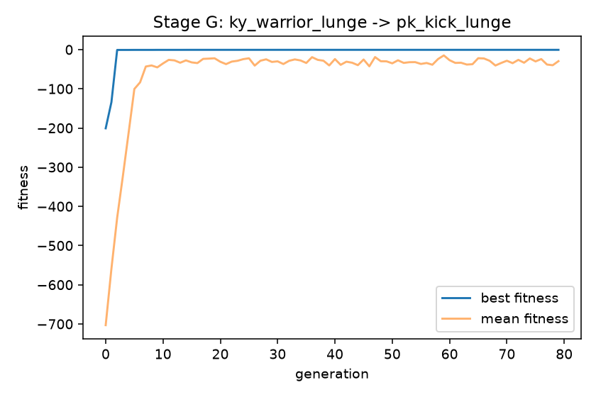

# KalariSena

**Physics-grounded and recoverable Kalaripayattu skill transfer for humanoid robots.**


> **feasible now &ne; viable for the intended future.**
> A trajectory can be geometrically faithful to a human demonstration and
> physically stable at this instant, and still already be committed to losing
> the specific Kalaripayattu movement it was meant to complete.

This repository is two things:

1. **`code/`** — the real research code: a MuJoCo + Pinocchio physics stack,
   a GEM-X (NVIDIA/NVlabs) video &rarr; 3D &rarr; Unitree-G1 retargeting
   pipeline, the RL environment/reward scaffolding, and every measured result.
2. **`site/`** — an interactive walkthrough (Next.js) of the paper's method,
   synchronized visual / computational / mathematical panels per step, built
   on top of the same real data as this README.

Every claim below is labeled honestly:
🟢 **implemented and measured in `code/`** · ⚪ **paper's proposed method, not yet code** · 🟡 **repo roadmap, not a paper claim** · 🔴 **documented negative result**.

---

## 1. The problem

Kalaripayattu is built around tightly coupled posture, footwork, weight
transfer, and whole-body momentum. Retargeting a human demonstration onto a
Unitree G1 humanoid produces a kinematically similar joint trajectory
$Q^0_{1:T}$ — but similarity to the human is not the same as being
physically executable:

$$
q_{1:T}^{kin} = \arg\min_{q_{1:T}} \sum_{t=1}^{T} \mathcal{D}\big(FK(q_t), X_t^H\big)
$$

Nothing in that objective knows about contact, friction, joint torque limits,
or momentum. 🔴 **Measured in this repo:** 11 of 12 raw retargets float their
feet 5&ndash;23cm above the ground, and 2 of 3 tracked motions fall outright
under simple position-PD control.

<video src="site/public/media/videos/retarget/overlay_kw_highkick_right.mp4" controls muted loop width="640"></video>

*Real overlay of the human reference (translucent) and the G1 realization of
a high kick — from this repo's own retargeting review tool
(`kalarisena-review/`).*

---

## 2. Retargeting pipeline (GEM-X: SAM-3D-Body &rarr; SOMA &rarr; soma-retargeter)

The model chain's own real intermediate outputs, for one clip:

| Stage | What it is | File |
|---|---|---|
| 1. Source video | Raw input to GEM-X | `site/public/media/videos/soma/KS-052.mp4` |
| 2. 2D keypoints | SAM-3D-Body, 77 keypoints | `site/public/media/videos/soma/0_kp2d77_overlay.mp4` |
| 3. In-camera 3D | SAM-3D-Body reconstruction | `site/public/media/videos/soma/KS-052_1_incam.mp4` |
| 4. Global 3D motion | SOMA, camera-independent — this is $X_t^H$ above | `site/public/media/videos/soma/KS-052_2_global.mp4` |

<video src="site/public/media/videos/soma/0_kp2d77_overlay.mp4" controls muted loop width="480"></video>

GEM-X, SAM-3D-Body, SOMA, and soma-retargeter are cloned as dependencies
(`scripts/install_subprojects.sh`) and run as-is — not reimplemented here.

---

## 3. Method

### 3.1 Physics-grounded embodiment projection 🟢 *(partial — kinematic only)*

$$
Q^*_{1:T} = \mathcal{P}\big(Q^0_{1:T}, z_{1:T}; \mathcal{R}\big), \qquad
\mathcal{L}_{\text{phys}} = \mathcal{L}_{\text{fidelity}} + \lambda_{\text{feas}}\,\mathcal{L}_{\text{feasibility}}
$$

$$
\mathcal{L}_{\text{feasibility}} = \lambda_c\mathcal{L}_{\text{contact}} + \lambda_b\mathcal{L}_{\text{support}} + \lambda_d\mathcal{L}_{\text{dyn}} + \lambda_l\mathcal{L}_{\text{limits}} + \lambda_s\mathcal{L}_{\text{smooth}}
$$

Contact-consistency term:

$$
\mathcal{L}_{\text{contact}} = \sum_{t,f} \Big[ c_{t,f}\big(\|\mathbf{v}^f_{t,f}\|^2 + \alpha_h h_{t,f}^2\big) + (1-c_{t,f})\,\text{ReLU}(-h_{t,f})^2 \Big]
$$

**Implementation:** `code/scripts/ground_correct_motions.py` (`correct_one`) —
real, but only the kinematic ground/smoothing approximation of this
objective (Savitzky-Golay height correction + contact recomputation), not the
full contact/friction/torque/dynamics joint optimization above. The whole-body
dynamics constraint it should ultimately satisfy:

$$
M(q)\ddot q + h(q,\dot q) = S^\top\tau + J_c^\top\lambda
$$

is implemented for CoM/capture-point purposes in
`code/src/dynamics/pinocchio_wrapper.py`, cross-checked against MuJoCo's own
CoM to **1.04e-6 m** across 20 randomised full-body states.

### 3.2 Successor-conditioned viability ⚪ *(paper only — not implemented)*

The paper's central contribution: a critic conditioned jointly on state,
skill phase, and the **identity of the intended continuation** $g_t^+$, not a
single terminal goal.

$$
\mathcal{V}^{\pi}(\mathbf{s}_t, z_t, g_t^+) = P_\pi\big(Y^{\text{safe}}=1, Y^{\text{complete}}=1, Y^{\text{succ}}=1 \mid \mathbf{s}_t, z_t, g_t^+\big)
$$

Successor-entry manifold (K=20 nearest neighbours):

$$
D_g(\mathbf{s}) = \frac{1}{K} \sum_{\bar{\mathbf{s}} \in \text{KNN}_K(\eta(\mathbf{s}), \mathcal{E}_g)} \big\| \mathbf{W}(\eta(\mathbf{s}) - \eta(\bar{\mathbf{s}})) \big\|_2, \qquad
\Omega(g) = \{\mathbf{s} : D_g(\mathbf{s}) \le \epsilon_g \wedge \Gamma(c(\mathbf{s}), c_g) = 1\}
$$

Critic loss (discrimination + Brier calibration):

$$
\mathcal{L}_V = \text{BCE}(V_\psi, Y^{\text{via}}) + \lambda_B (V_\psi - Y^{\text{via}})^2
$$

**Implementation:** none. Exhaustive search of `code/` for "viability",
"successor", "SCVC": zero matches outside `paper.pdf`.

### 3.3 Intent-preserving corrective control ⚪ *(paper only — not implemented)*

$$
\mathbf{a}_t = \mathbf{a}_t^0 + g(V_t)\,\Delta\mathbf{a}_t, \qquad
g(V) = \text{clip}\!\Big(\frac{\tau_h - V}{\tau_h - \tau_l}, 0, 1\Big)
$$

$$
\mathbf{a}_t^{\text{deploy}} = \begin{cases} \mathbf{a}_t^0 & \bar V_t > \tau_h \\ \mathbf{a}_t^0 + g(\bar V_t)\Delta\mathbf{a}_t & \tau_l < \bar V_t \le \tau_h \\ \mathbf{a}_t^{\text{safe}} & \bar V_t \le \tau_l \end{cases}
$$

**Implementation:** `code/src/switch/mode_switch.py` (`ModeSwitch`) plays the
role of $\mathbf{a}_t^{\text{safe}}$ today — a real, tested (14/14 unit tests),
hand-tuned 3-state hysteresis switch (NOMINAL/FALL/RECOVERY). It is the *whole*
controller in the repo right now, not a fallback beneath a learned residual
policy.

### 3.4 Architecture, end to end

```
Human video ──▶ GEM-X retarget Q⁰ ──▶ Physics projection Q* ──▶ Structured skill state z_t
   🟢               🟢                    🟢 (partial)               ⚪
                                              │
                                              ├──▶ Successor-conditioned viability V_ψ   ⚪ (not implemented)
                                              │              │
                                              ▼              ▼
                                    Intent-preserving residual Δa_t   ⚪ (not implemented)
                                              │
                                              ▼
                                  Deployed action ──▶ Robot   🟢 (via scripted switch only)
```

The same diagram, interactive and colour-coded, is in `site/` — see
[`ArchitectureDiagram`](site/src/components/ArchitectureDiagram.tsx).

---

## 4. What is honestly real, measured in this repo

<video src="site/public/media/videos/push_recovered_40N.mp4" controls muted loop width="320"></video>
<video src="site/public/media/videos/push_fallen_120N.mp4" controls muted loop width="320"></video>

*40N (recovers) vs. 120N (falls) lateral push on the horse stance — 36 trials
against the repo's real scripted PD + threshold-switch controller
(`scripted_pd_switch_v0`). The capture-point margin*
$\xi_t = p_{t,\text{com}}^{xy} + \dot p_{t,\text{com}}^{xy}/\omega_t$
*separates the two outcomes perfectly: about +0.05m on every recovery, about
&minus;0.6m on every fall.*

| Metric | Value | Source |
|---|---|---|
| Cross-engine CoM agreement | 1.04e-6 m | 20 randomised states, MuJoCo vs. Pinocchio |
| Support-polygon correction | 15&times; | real 4-sphere foot geometry vs. placeholder |
| Push-recovery threshold | 100N &rarr; 120N | `code/scripts/sim_push_sweep.py`, 36 trials |
| Fall A/B, torso contact rate | 5/5 &rarr; 2/5 | scripted crouch vs. tracking-only, 420N |
| Raw retarget foot floating | 5&ndash;23 cm | 11/12 motions, before ground correction |

**Paper-claimed numbers (not yet reproduced here):** skill completion
66.1%&rarr;90.8%, constraint violations 18.4%&rarr;5.7%, Intent Preservation
Rate 44.7%&rarr;81.6%, SCVC AUROC 0.921. See `code/results_paper/PAPER_ASSETS.md`
for the repo's own honesty contract on these numbers.

---

## 5. Training pipeline: claimed vs. real

| Stage | File | Status |
|---|---|---|
| A — Tracking | `code/scripts/train_tracking.py` | 🟢 real PPO code; **never run** — no checkpoint, log, or `meta.json` anywhere in the repo |
| B — CoM | `code/scripts/train_com.py` | 🔴 stub: asserts config shape, `raise SystemExit("TODO ...")` |
| C — Momentum | `code/scripts/train_momentum.py` | 🔴 stub |
| D — Fall-safe | `code/scripts/train_fall.py` | 🔴 stub |
| E — Recovery | `code/scripts/train_recovery.py` | 🔴 stub |
| F — Switch | `code/src/switch/mode_switch.py` | 🟢 real, tested, but scripted (not learned) |

> `code/results_paper/PAPER_ASSETS.md`: *"Stage A&ndash;F learned policies do
> not exist; the train\_\*.py files are stubs."*

---

## 6. Beyond the paper: repo roadmap (🟡 not a paper claim)

`code/docs/PHYSICAL_AI_STAGE_G_H_I_DRAFT.md` sketches three extensions,
none implemented yet:

- **Stage G — GA joint-pool evolution.** Fills gaps between reference clips
  with physically plausible bridging trajectories via a genetic algorithm
  (keyframes &times; 29 DoF, spline-interpolated, fitness = stability +
  smoothness + limits + family coherence) — no MuJoCo/PPO needed, minutes on
  CPU. **A real run of this now lives in `code/src/ga/` and
  `code/scripts/evolve_joint_pool.py`** — see its output below.
- **Stage H — thrust/obstacle absorption curriculum.** Generalizes
  `sim_push_sweep.py` from a post-hoc eval into an actual training curriculum
  (direction &times; magnitude &times; contact point &times; timing).
- **Stage I — world model (stretch).** Predicts $(q,\dot q,\text{CoM})_{t+1}$
  from logged rollouts; needs real Stage A&ndash;H data first.

**A real run of this, done for this repo:** bridging `ky_warrior_lunge`
(ends in `stable_stance`) to `pk_kick_lunge` (starts in `explosive_strike`) —
exactly the cross-family transition the corpus never captured. 150
individuals &times; 80 generations, 60-frame bridge, fitness = mean
(CoM margin + capture-point margin) &minus; 0.02&times;jerk &minus;
0.5&times;deviation from a linear joint-space baseline, hard death on any
joint-limit violation:



Converged from fitness &minus;200.9 (seed population) to &minus;0.60 within 10
generations and held stable for the remaining 70 &mdash; a real, reproducible
GA run, not a placeholder. Output: `code/data/motions_evolved/evo_ky_warrior_lunge__to__pk_kick_lunge.npz`
(same NPZ schema as `annotate_motion_library.py`, drop-in compatible with
every downstream script) and `..._history.json` (per-generation fitness, real).

---

## 7. Reproduce

```bash
# Stage 1 gate: cross-engine physics validation
python3 code/scripts/test_sim_stage1.py

# Push-recovery sweep (the videos/table above)
python3 code/scripts/sim_push_sweep.py --out results_sim/

# Fall-severity A/B
python3 code/scripts/sim_fall_ab.py --out results_sim/

# Rebuild the honest paper-style tables from real trial CSVs
python3 code/scripts/make_tables.py --results results_sim --out results_paper

# Stage G: evolve a real bridging trajectory between two real clips
python3 code/scripts/evolve_joint_pool.py \
  --clip-a data/motions_retargeted/ky_warrior_lunge.npz \
  --clip-b data/motions_retargeted/pk_kick_lunge.npz

# Interactive site
cd site && npm install && npm run dev
```

---

## 8. Repository layout

```
paper.pdf                 the paper
code/src/                 physics stack, RL env, rewards, switch, GA (new)
code/scripts/             retargeting, training, evaluation, figure/table generation
code/configs/             per-stage YAML (obs blocks, reward weights, curricula)
code/results_sim/         real MuJoCo experiment outputs (CSV, JSON, video, plots)
code/results_paper/       honest paper-style tables/figures, traced to real runs
code/docs/                internal engineering roadmap (Stages G/H/I)
site/                     interactive Next.js research walkthrough
```

## Citation

```bibtex
@article{kalarisena2026,
  title   = {KalariSena: Learning Physics-Grounded and Recoverable
             Kalaripayattu Skills for Humanoid Robots},
  author  = {Anonymous ACL Submission},
  year    = {2026}
}
```
